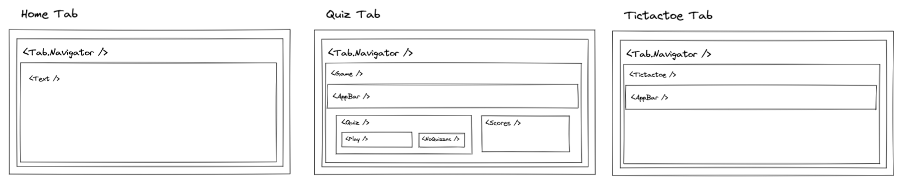

# my-native-games

Awesome application to play some games in your smartphone (iOS or Android)

## Run it

Use expo to run it:

```
    yarn install && expo start
```

Then follow instructions on the console to run it either on physicall or emulated device.

## Component diagram


