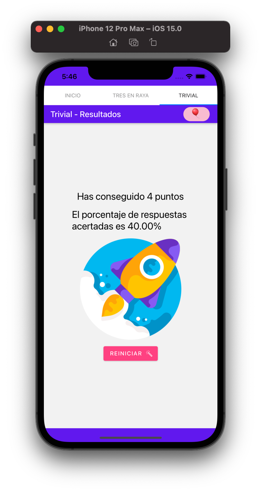
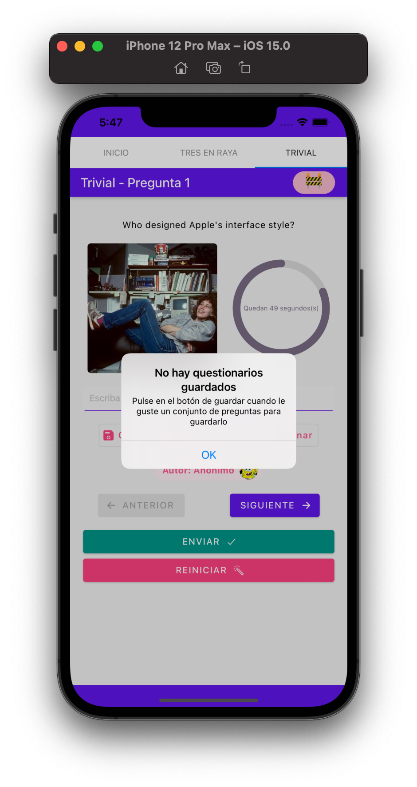

# react-native-games-app

Awesome application to play some games in your smartphone (iOS or Android)

## Run it

Use expo to run it:

```
    yarn install && expo start
```

Then follow instructions on the console to run it either on physicall or emulated device.

## Some screenshots

### iPhone
#### Splash Screen

#### Home Screen

#### Tictactoe Game

#### Quiz Game
##### Quiz Question

##### Quiz Loading

##### Quiz Scores

##### Quiz Alert


### Android
#### Splash Screen

#### Home Screen

#### Tictactoe Game

#### Quiz Game
##### Quiz Question

##### Quiz Loading

##### Quiz Scores

##### Quiz Alert


## Component diagrams

### Home Component


### Tictactoe Component


### Quiz Component

